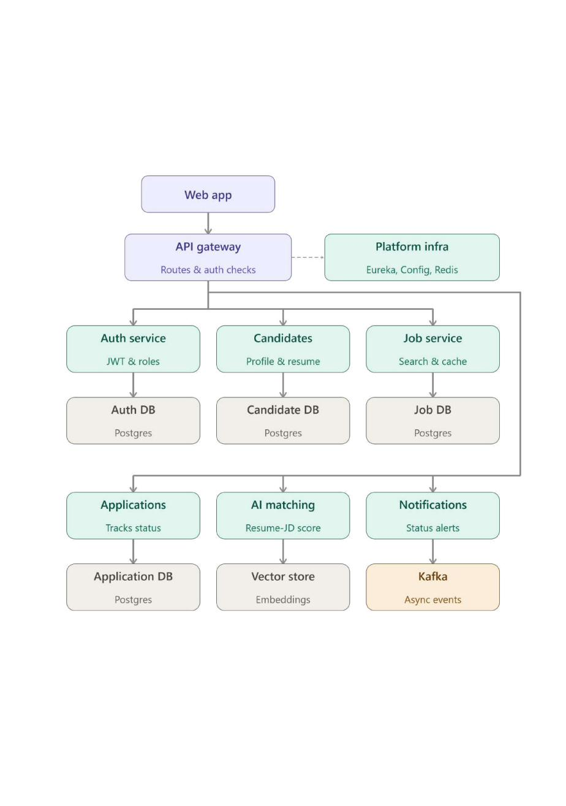
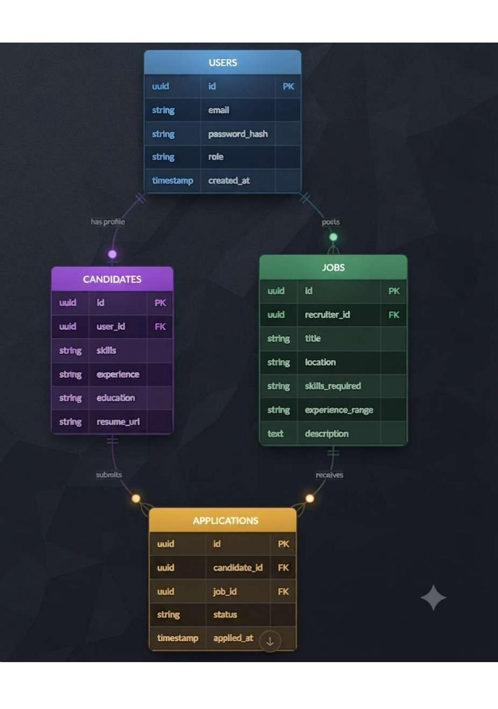

# jobboard-pro
Microservices-based job board platform with Spring Boot, React, AI matching

## Tech Stack
| Layer | Tech |
|---|---|
| Backend | Spring Boot, Spring Cloud (Eureka, Config Server, Gateway) |
| Database | PostgreSQL (DB-per-service) |
| Caching | Redis |
| AI | Spring AI, Ollama (RAG) |
| Frontend | React, Bootstrap |
| Auth | JWT |
| DevOps | Docker, Jenkins, Kubernetes |
| Cloud | AWS (RDS, S3, EC2, IAM, Elastic Beanstalk) |

## Architecture

## ER Diagrams

## Services
- Auth Service
- Candidate Service
- Job Service
- Application Service
- AI Matching Service
- Notification Service

## How to Run
_(coming soon — Phase 9: Containerization)_